# Republic School of Journalism - Database Schema Design

## Overview
This document outlines the complete database schema for the Republic School of Journalism e-learning platform, designed to support all the features identified in the codebase.

## Entity Relationship Diagram (ERD)

```mermaid
erDiagram
    %% Core User Management
    USERS {
        uuid id PK
        varchar email UK
        varchar name
        varchar phone
        text avatar_url
        enum role
        varchar student_id UK
        varchar department
        varchar semester
        varchar academic_year
        text bio
        varchar location
        timestamp join_date
        timestamp created_at
        timestamp updated_at
        boolean is_active
    }

    %% Extended Profile Information
    USER_PROFILES {
        uuid id PK
        uuid user_id FK
        jsonb personal_info
        jsonb address_info
        jsonb education_info
        jsonb parent_guardian_info
        jsonb emergency_contact_info
        jsonb medical_info
        jsonb professional_info
        jsonb learning_preferences
        jsonb additional_info
        jsonb references
        integer completion_percentage
        timestamp last_updated
    }

    %% Course Management
    COURSES {
        uuid id PK
        varchar title
        text description
        varchar course_code UK
        integer credits
        varchar level
        varchar category
        varchar department
        varchar semester
        varchar academic_year
        decimal price
        text thumbnail_url
        text syllabus
        integer duration_weeks
        boolean is_active
        timestamp created_at
        timestamp updated_at
    }

    %% Course Instructors (Many-to-Many)
    COURSE_INSTRUCTORS {
        uuid course_id FK
        uuid instructor_id FK
        boolean is_primary
        timestamp assigned_at
    }

    %% Course Enrollments
    ENROLLMENTS {
        uuid id PK
        uuid student_id FK
        uuid course_id FK
        timestamp enrollment_date
        enum status
        decimal progress_percentage
        timestamp completion_date
        decimal final_grade
        varchar letter_grade
        timestamp created_at
        timestamp updated_at
    }

    %% Lectures/Sessions
    LECTURES {
        uuid id PK
        uuid course_id FK
        varchar title
        text description
        date lecture_date
        time start_time
        integer duration_minutes
        varchar venue
        text recording_url
        jsonb materials
        boolean is_mandatory
        timestamp created_at
        timestamp updated_at
    }

    %% Attendance Tracking
    ATTENDANCE {
        uuid id PK
        uuid lecture_id FK
        uuid student_id FK
        enum status
        timestamp check_in_time
        enum check_in_method
        text notes
        timestamp created_at
    }

    %% Assignments
    ASSIGNMENTS {
        uuid id PK
        uuid course_id FK
        varchar title
        text description
        enum type
        enum priority
        integer max_score
        decimal weight
        timestamp due_date
        jsonb attachments
        jsonb rubric
        boolean is_active
        timestamp created_at
        timestamp updated_at
    }

    %% Assignment Submissions
    SUBMISSIONS {
        uuid id PK
        uuid assignment_id FK
        uuid student_id FK
        text submission_url
        jsonb submitted_files
        timestamp submitted_at
        enum status
        text notes
        timestamp created_at
        timestamp updated_at
    }

    %% Grades
    GRADES {
        uuid id PK
        uuid submission_id FK
        uuid assignment_id FK
        uuid student_id FK
        uuid graded_by FK
        decimal score
        decimal percentage
        varchar letter_grade
        text feedback
        timestamp graded_at
        timestamp created_at
        timestamp updated_at
    }

    %% Chat/Communication
    CHAT_ROOMS {
        uuid id PK
        varchar name
        enum type
        uuid course_id FK
        jsonb participants
        boolean is_active
        timestamp created_at
        timestamp updated_at
    }

    CHAT_MESSAGES {
        uuid id PK
        uuid room_id FK
        uuid sender_id FK
        text content
        enum message_type
        text file_url
        varchar file_name
        boolean is_read
        timestamp sent_at
        timestamp created_at
    }

    %% Doubts/Q&A
    DOUBTS {
        uuid id PK
        varchar title
        text content
        varchar category
        uuid course_id FK
        uuid author_id FK
        integer upvotes
        boolean is_resolved
        jsonb tags
        timestamp created_at
        timestamp updated_at
    }

    DOUBT_RESPONSES {
        uuid id PK
        uuid doubt_id FK
        uuid author_id FK
        text content
        integer upvotes
        boolean is_accepted
        timestamp created_at
        timestamp updated_at
    }

    %% Feedback System
    COURSE_FEEDBACK {
        uuid id PK
        uuid course_id FK
        uuid student_id FK
        uuid instructor_id FK
        decimal overall_rating
        jsonb category_ratings
        text comment
        text suggestions
        boolean is_anonymous
        varchar semester
        varchar academic_year
        timestamp created_at
    }

    %% Payment Management
    PAYMENT_METHODS {
        uuid id PK
        uuid user_id FK
        enum type
        varchar last_four
        varchar expiry_month
        varchar expiry_year
        varchar holder_name
        boolean is_default
        boolean is_active
        timestamp created_at
        timestamp updated_at
    }

    COURSE_PAYMENTS {
        uuid id PK
        uuid course_id FK
        uuid student_id FK
        decimal total_amount
        decimal paid_amount
        enum status
        enum payment_plan
        timestamp purchase_date
        timestamp next_payment_date
        timestamp created_at
        timestamp updated_at
    }

    TRANSACTIONS {
        uuid id PK
        varchar transaction_id UK
        uuid user_id FK
        uuid course_payment_id FK
        uuid payment_method_id FK
        decimal amount
        enum type
        enum status
        text description
        text receipt_url
        timestamp processed_at
        timestamp created_at
    }

    %% Achievements & Gamification
    ACHIEVEMENTS {
        uuid id PK
        varchar title
        text description
        varchar icon
        enum type
        jsonb criteria
        boolean is_active
        timestamp created_at
    }

    USER_ACHIEVEMENTS {
        uuid id PK
        uuid user_id FK
        uuid achievement_id FK
        timestamp earned_at
        text certificate_url
    }

    %% Notifications
    NOTIFICATIONS {
        uuid id PK
        uuid user_id FK
        varchar title
        text content
        enum type
        jsonb data
        boolean is_read
        timestamp read_at
        timestamp created_at
    }

    %% System Settings
    USER_SETTINGS {
        uuid id PK
        uuid user_id FK
        jsonb notification_preferences
        jsonb privacy_settings
        jsonb appearance_settings
        timestamp updated_at
    }

    %% Relationships
    USERS ||--o{ USER_PROFILES : has
    USERS ||--o{ ENROLLMENTS : enrolls
    USERS ||--o{ ATTENDANCE : attends
    USERS ||--o{ SUBMISSIONS : submits
    USERS ||--o{ GRADES : receives
    USERS ||--o{ CHAT_MESSAGES : sends
    USERS ||--o{ DOUBTS : asks
    USERS ||--o{ DOUBT_RESPONSES : responds
    USERS ||--o{ COURSE_FEEDBACK : gives
    USERS ||--o{ PAYMENT_METHODS : owns
    USERS ||--o{ COURSE_PAYMENTS : makes
    USERS ||--o{ TRANSACTIONS : performs
    USERS ||--o{ USER_ACHIEVEMENTS : earns
    USERS ||--o{ NOTIFICATIONS : receives
    USERS ||--o{ USER_SETTINGS : configures

    COURSES ||--o{ COURSE_INSTRUCTORS : taught_by
    COURSES ||--o{ ENROLLMENTS : has
    COURSES ||--o{ LECTURES : contains
    COURSES ||--o{ ASSIGNMENTS : includes
    COURSES ||--o{ CHAT_ROOMS : has
    COURSES ||--o{ DOUBTS : relates_to
    COURSES ||--o{ COURSE_FEEDBACK : receives
    COURSES ||--o{ COURSE_PAYMENTS : paid_for

    LECTURES ||--o{ ATTENDANCE : tracked_in
    ASSIGNMENTS ||--o{ SUBMISSIONS : receives
    ASSIGNMENTS ||--o{ GRADES : graded_for
    SUBMISSIONS ||--o{ GRADES : graded_as

    CHAT_ROOMS ||--o{ CHAT_MESSAGES : contains
    DOUBTS ||--o{ DOUBT_RESPONSES : has
    ACHIEVEMENTS ||--o{ USER_ACHIEVEMENTS : awarded_as
    COURSE_PAYMENTS ||--o{ TRANSACTIONS : generates
    PAYMENT_METHODS ||--o{ TRANSACTIONS : processes
```



## Table Definitions

### Core User Management

#### USERS
Primary user entity storing basic information for students, instructors, and administrators.

```sql
CREATE TABLE users (
    id UUID PRIMARY KEY DEFAULT gen_random_uuid(),
    email VARCHAR(255) UNIQUE NOT NULL,
    name VARCHAR(255) NOT NULL,
    phone VARCHAR(20),
    avatar_url TEXT,
    role user_role NOT NULL DEFAULT 'student',
    student_id VARCHAR(50) UNIQUE,
    department VARCHAR(100),
    semester VARCHAR(50),
    academic_year VARCHAR(10),
    bio TEXT,
    location VARCHAR(255),
    join_date TIMESTAMP DEFAULT CURRENT_TIMESTAMP,
    created_at TIMESTAMP DEFAULT CURRENT_TIMESTAMP,
    updated_at TIMESTAMP DEFAULT CURRENT_TIMESTAMP,
    is_active BOOLEAN DEFAULT true
);

CREATE TYPE user_role AS ENUM ('student', 'instructor', 'admin');
```

#### USER_PROFILES
Extended profile information stored as JSONB for flexibility.

```sql
CREATE TABLE user_profiles (
    id UUID PRIMARY KEY DEFAULT gen_random_uuid(),
    user_id UUID REFERENCES users(id) ON DELETE CASCADE,
    personal_info JSONB,
    address_info JSONB,
    education_info JSONB,
    parent_guardian_info JSONB,
    emergency_contact_info JSONB,
    medical_info JSONB,
    professional_info JSONB,
    learning_preferences JSONB,
    additional_info JSONB,
    references JSONB,
    completion_percentage INTEGER DEFAULT 0,
    last_updated TIMESTAMP DEFAULT CURRENT_TIMESTAMP
);
```

### Academic Management

#### COURSES
Core course information and metadata.

```sql
CREATE TABLE courses (
    id UUID PRIMARY KEY DEFAULT gen_random_uuid(),
    title VARCHAR(255) NOT NULL,
    description TEXT,
    course_code VARCHAR(20) UNIQUE NOT NULL,
    credits INTEGER DEFAULT 3,
    level course_level NOT NULL,
    category VARCHAR(100),
    department VARCHAR(100),
    semester VARCHAR(50),
    academic_year VARCHAR(10),
    price DECIMAL(10,2),
    thumbnail_url TEXT,
    syllabus TEXT,
    duration_weeks INTEGER,
    is_active BOOLEAN DEFAULT true,
    created_at TIMESTAMP DEFAULT CURRENT_TIMESTAMP,
    updated_at TIMESTAMP DEFAULT CURRENT_TIMESTAMP
);

CREATE TYPE course_level AS ENUM ('Beginner', 'Intermediate', 'Advanced');
```

#### ENROLLMENTS
Student course enrollments and progress tracking.

```sql
CREATE TABLE enrollments (
    id UUID PRIMARY KEY DEFAULT gen_random_uuid(),
    student_id UUID REFERENCES users(id) ON DELETE CASCADE,
    course_id UUID REFERENCES courses(id) ON DELETE CASCADE,
    enrollment_date TIMESTAMP DEFAULT CURRENT_TIMESTAMP,
    status enrollment_status DEFAULT 'active',
    progress_percentage DECIMAL(5,2) DEFAULT 0,
    completion_date TIMESTAMP,
    final_grade DECIMAL(5,2),
    letter_grade VARCHAR(5),
    created_at TIMESTAMP DEFAULT CURRENT_TIMESTAMP,
    updated_at TIMESTAMP DEFAULT CURRENT_TIMESTAMP,
    UNIQUE(student_id, course_id)
);

CREATE TYPE enrollment_status AS ENUM ('active', 'completed', 'dropped', 'suspended');
```

### Assessment & Grading

#### ASSIGNMENTS
Assignment definitions and metadata.

```sql
CREATE TABLE assignments (
    id UUID PRIMARY KEY DEFAULT gen_random_uuid(),
    course_id UUID REFERENCES courses(id) ON DELETE CASCADE,
    title VARCHAR(255) NOT NULL,
    description TEXT,
    type assignment_type NOT NULL,
    priority assignment_priority DEFAULT 'medium',
    max_score INTEGER DEFAULT 100,
    weight DECIMAL(3,2) DEFAULT 0.1,
    due_date TIMESTAMP NOT NULL,
    attachments JSONB,
    rubric JSONB,
    is_active BOOLEAN DEFAULT true,
    created_at TIMESTAMP DEFAULT CURRENT_TIMESTAMP,
    updated_at TIMESTAMP DEFAULT CURRENT_TIMESTAMP
);

CREATE TYPE assignment_type AS ENUM ('assignment', 'quiz', 'exam', 'project', 'participation');
CREATE TYPE assignment_priority AS ENUM ('low', 'medium', 'high');
```

#### SUBMISSIONS
Student assignment submissions.

```sql
CREATE TABLE submissions (
    id UUID PRIMARY KEY DEFAULT gen_random_uuid(),
    assignment_id UUID REFERENCES assignments(id) ON DELETE CASCADE,
    student_id UUID REFERENCES users(id) ON DELETE CASCADE,
    submission_url TEXT,
    submitted_files JSONB,
    submitted_at TIMESTAMP DEFAULT CURRENT_TIMESTAMP,
    status submission_status DEFAULT 'submitted',
    notes TEXT,
    created_at TIMESTAMP DEFAULT CURRENT_TIMESTAMP,
    updated_at TIMESTAMP DEFAULT CURRENT_TIMESTAMP,
    UNIQUE(assignment_id, student_id)
);

CREATE TYPE submission_status AS ENUM ('draft', 'submitted', 'graded', 'returned');
```

#### GRADES
Grade records and feedback.

```sql
CREATE TABLE grades (
    id UUID PRIMARY KEY DEFAULT gen_random_uuid(),
    submission_id UUID REFERENCES submissions(id) ON DELETE CASCADE,
    assignment_id UUID REFERENCES assignments(id) ON DELETE CASCADE,
    student_id UUID REFERENCES users(id) ON DELETE CASCADE,
    graded_by UUID REFERENCES users(id),
    score DECIMAL(5,2) NOT NULL,
    percentage DECIMAL(5,2) NOT NULL,
    letter_grade VARCHAR(5),
    feedback TEXT,
    graded_at TIMESTAMP DEFAULT CURRENT_TIMESTAMP,
    created_at TIMESTAMP DEFAULT CURRENT_TIMESTAMP,
    updated_at TIMESTAMP DEFAULT CURRENT_TIMESTAMP
);
```

### Communication & Collaboration

#### CHAT_ROOMS
Chat room definitions for course and direct messaging.

```sql
CREATE TABLE chat_rooms (
    id UUID PRIMARY KEY DEFAULT gen_random_uuid(),
    name VARCHAR(255) NOT NULL,
    type chat_room_type NOT NULL,
    course_id UUID REFERENCES courses(id) ON DELETE CASCADE,
    participants JSONB,
    is_active BOOLEAN DEFAULT true,
    created_at TIMESTAMP DEFAULT CURRENT_TIMESTAMP,
    updated_at TIMESTAMP DEFAULT CURRENT_TIMESTAMP
);

CREATE TYPE chat_room_type AS ENUM ('course', 'direct', 'group');
```

#### DOUBTS
Q&A system for student questions.

```sql
CREATE TABLE doubts (
    id UUID PRIMARY KEY DEFAULT gen_random_uuid(),
    title VARCHAR(255) NOT NULL,
    content TEXT NOT NULL,
    category VARCHAR(100),
    course_id UUID REFERENCES courses(id) ON DELETE SET NULL,
    author_id UUID REFERENCES users(id) ON DELETE CASCADE,
    upvotes INTEGER DEFAULT 0,
    is_resolved BOOLEAN DEFAULT false,
    tags JSONB,
    created_at TIMESTAMP DEFAULT CURRENT_TIMESTAMP,
    updated_at TIMESTAMP DEFAULT CURRENT_TIMESTAMP
);
```

### Payment & Billing

#### COURSE_PAYMENTS
Course payment tracking and installment management.

```sql
CREATE TABLE course_payments (
    id UUID PRIMARY KEY DEFAULT gen_random_uuid(),
    course_id UUID REFERENCES courses(id) ON DELETE CASCADE,
    student_id UUID REFERENCES users(id) ON DELETE CASCADE,
    total_amount DECIMAL(10,2) NOT NULL,
    paid_amount DECIMAL(10,2) DEFAULT 0,
    status payment_status DEFAULT 'pending',
    payment_plan payment_plan_type DEFAULT 'full',
    purchase_date TIMESTAMP DEFAULT CURRENT_TIMESTAMP,
    next_payment_date TIMESTAMP,
    created_at TIMESTAMP DEFAULT CURRENT_TIMESTAMP,
    updated_at TIMESTAMP DEFAULT CURRENT_TIMESTAMP
);

CREATE TYPE payment_status AS ENUM ('pending', 'partial', 'completed', 'failed', 'refunded');
CREATE TYPE payment_plan_type AS ENUM ('full', 'installment');
```

## Indexes for Performance

```sql
-- User indexes
CREATE INDEX idx_users_email ON users(email);
CREATE INDEX idx_users_student_id ON users(student_id);
CREATE INDEX idx_users_role ON users(role);

-- Course indexes
CREATE INDEX idx_courses_code ON courses(course_code);
CREATE INDEX idx_courses_department ON courses(department);
CREATE INDEX idx_courses_active ON courses(is_active);

-- Enrollment indexes
CREATE INDEX idx_enrollments_student ON enrollments(student_id);
CREATE INDEX idx_enrollments_course ON enrollments(course_id);
CREATE INDEX idx_enrollments_status ON enrollments(status);

-- Assignment indexes
CREATE INDEX idx_assignments_course ON assignments(course_id);
CREATE INDEX idx_assignments_due_date ON assignments(due_date);
CREATE INDEX idx_assignments_type ON assignments(type);

-- Grade indexes
CREATE INDEX idx_grades_student ON grades(student_id);
CREATE INDEX idx_grades_assignment ON grades(assignment_id);
CREATE INDEX idx_grades_graded_at ON grades(graded_at);

-- Attendance indexes
CREATE INDEX idx_attendance_student ON attendance(student_id);
CREATE INDEX idx_attendance_lecture ON attendance(lecture_id);
CREATE INDEX idx_attendance_date ON attendance(check_in_time);

-- Chat indexes
CREATE INDEX idx_chat_messages_room ON chat_messages(room_id);
CREATE INDEX idx_chat_messages_sender ON chat_messages(sender_id);
CREATE INDEX idx_chat_messages_sent_at ON chat_messages(sent_at);

-- Payment indexes
CREATE INDEX idx_transactions_user ON transactions(user_id);
CREATE INDEX idx_transactions_status ON transactions(status);
CREATE INDEX idx_transactions_processed_at ON transactions(processed_at);
```

## Key Features Supported

1. **User Management**: Complete user profiles with role-based access
2. **Course Management**: Full course lifecycle with enrollments and progress tracking
3. **Assessment System**: Assignments, submissions, and grading with rubrics
4. **Attendance Tracking**: Lecture attendance with multiple check-in methods
5. **Communication**: Chat rooms and Q&A system
6. **Payment Processing**: Course payments with installment support
7. **Feedback System**: Course and instructor feedback collection
8. **Gamification**: Achievement system with user progress tracking
9. **Notifications**: Comprehensive notification system
10. **Analytics**: Data structure supports reporting and analytics

This schema provides a solid foundation for the Republic School of Journalism e-learning platform with room for future expansion and optimization.